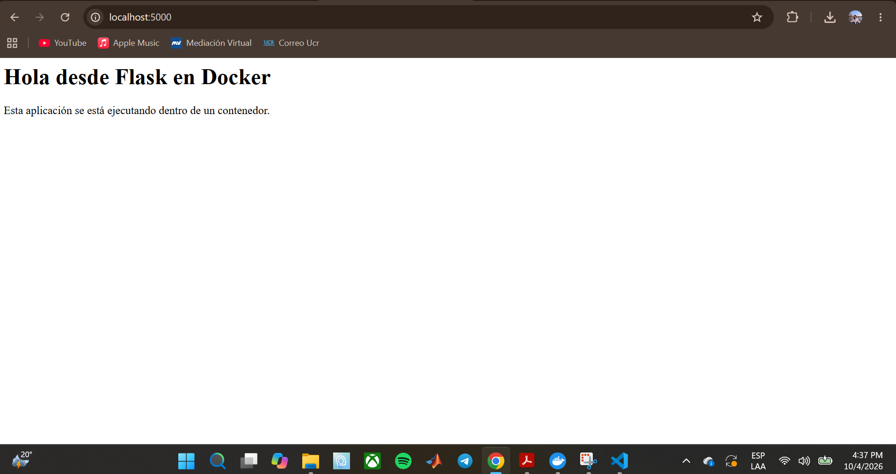
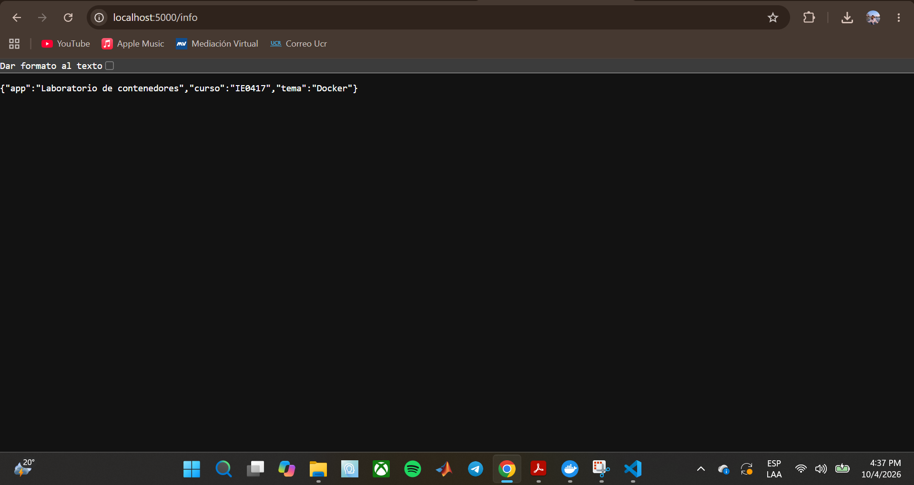

# Parte 4: Aplicación Flask y construcción de una imagen con Dockerfile

Esta parte tiene dos secciones: primero la aplicación web sencilla que se va a ejecutar en un contenedor, y luego el `Dockerfile` con el que se construye su imagen.

---

# Sección A: Crear una aplicación sencilla

## Objetivo

Crear una aplicación web mínima con Flask para ejecutarla después dentro de un contenedor.

## Archivos creados

Dentro de la carpeta `app/` creé dos archivos.

**`app.py`**

```python
from flask import Flask
import os

app = Flask(__name__)


@app.route("/")
def home():
    mensaje = os.environ.get("MENSAJE", "Hola desde Flask en Docker")
    return f"""
    <h1>{mensaje}</h1>
    <p>Esta aplicación se está ejecutando dentro de un contenedor.</p>
    """


@app.route("/info")
def info():
    return {
        "app": "Laboratorio de contenedores",
        "curso": "IE0417",
        "tema": "Docker"
    }


if __name__ == "__main__":
    app.run(host="0.0.0.0", port=5000)
```

**`requirements.txt`**

```text
flask
```

## Prueba local

Como tengo Python instalado, probé la aplicación localmente, desde la carpeta `app/`, con los comandos que indica el laboratorio.

### Comando ejecutado: `pip install -r requirements.txt`

```powershell
pip install -r requirements.txt
```

#### Explicación

Instala en mi computadora todas las dependencias listadas en `requirements.txt`. Como Flask depende a su vez de otras librerías, `pip` las resolvió e instaló también.

#### Resultado obtenido

```text
Collecting flask (from -r requirements.txt (line 1))
  Downloading flask-3.1.3-py3-none-any.whl.metadata (3.2 kB)
Collecting blinker>=1.9.0 (from flask->-r requirements.txt (line 1))
Collecting click>=8.1.3 (from flask->-r requirements.txt (line 1))
Collecting itsdangerous>=2.2.0 (from flask->-r requirements.txt (line 1))
Collecting jinja2>=3.1.2 (from flask->-r requirements.txt (line 1))
Collecting markupsafe>=2.1.1 (from flask->-r requirements.txt (line 1))
Collecting werkzeug>=3.1.0 (from flask->-r requirements.txt (line 1))
...
Installing collected packages: markupsafe, itsdangerous, click, blinker, werkzeug, jinja2, flask
Successfully installed blinker-1.9.0 click-8.5.0 flask-3.1.3 itsdangerous-2.2.0 jinja2-3.1.6 markupsafe-3.0.4 werkzeug-3.1.9
```

Aunque en `requirements.txt` solo escribí `flask`, se instalaron siete paquetes: Flask y sus seis dependencias.

### Comando ejecutado: `python app.py`

```powershell
python app.py
```

#### Explicación

Ejecuta la aplicación con el Python de mi computadora. Levanta el servidor de desarrollo de Flask en el puerto 5000.

#### Resultado obtenido

```text
 * Serving Flask app 'app'
 * Debug mode: off
WARNING: This is a development server. Do not use it in a production deployment. Use a production WSGI server instead.
 * Running on all addresses (0.0.0.0)
 * Running on http://127.0.0.1:5000
 * Running on http://192.168.100.87:5000
Press CTRL+C to quit
127.0.0.1 - - [04/Oct/2026 16:36:52] "GET / HTTP/1.1" 200 -
127.0.0.1 - - [04/Oct/2026 16:36:52] "GET /favicon.ico HTTP/1.1" 404 -
127.0.0.1 - - [04/Oct/2026 16:37:04] "GET /info HTTP/1.1" 200 -
```

#### Qué observé

- Abrí `http://localhost:5000` y `http://localhost:5000/info` en el navegador. Los logs registran las dos peticiones con código `200` (`GET /` y `GET /info`), es decir, ambas rutas respondieron correctamente.
- La petición `GET /favicon.ico` devolvió `404`. Es normal: el navegador pide automáticamente el ícono de la pestaña y la aplicación no define esa ruta.
- Flask muestra `Running on all addresses (0.0.0.0)`, por el `host="0.0.0.0"` del código, y además dos direcciones: `127.0.0.1` (mi propia máquina) y `192.168.100.87` (mi dirección dentro de la red local).
- La terminal quedó ocupada mientras la aplicación corría, y se detiene con `Ctrl + C`.

#### Captura del navegador

`http://localhost:5000`:



`http://localhost:5000/info`:



## Qué hace la aplicación

Es un servidor web pequeño hecho con Flask. Al visitar la página principal muestra un título con un mensaje y una línea que indica que la aplicación se ejecuta dentro de un contenedor. El mensaje se toma de la variable de entorno `MENSAJE`; si esa variable no existe, usa el texto por defecto "Hola desde Flask en Docker".

## Rutas que tiene

| Ruta | Qué devuelve |
|---|---|
| `/` | Una página HTML con el mensaje (`<h1>`) y un párrafo |
| `/info` | Un JSON con los campos `app`, `curso` y `tema` |

## Dependencia que utiliza

Utiliza **Flask**, un framework de Python para crear aplicaciones web. Está declarada en `requirements.txt`. El módulo `os`, que también se importa, viene incluido con Python y no necesita instalarse.

## Por qué se usa `host="0.0.0.0"` en lugar de `localhost`

Dentro de un contenedor, `localhost` (127.0.0.1) significa "el propio contenedor". Si la aplicación escuchara solo ahí, únicamente podría recibir conexiones originadas desde dentro del mismo contenedor, y nada de afuera podría llegar a ella. Con `0.0.0.0` la aplicación escucha en todas las interfaces de red del contenedor, por lo que puede recibir conexiones que lleguen desde el exterior una vez que el puerto esté publicado.

Esto se ve en los logs de la ejecución, donde Flask indicó `Running on all addresses (0.0.0.0)`.

## Preguntas de reflexión (Sección A)

**1. ¿Qué hace Flask en esta aplicación?**

Flask es el framework que convierte el programa en un servidor web. Se encarga de recibir las peticiones HTTP y de asociar cada ruta (`/` e `/info`) con la función de Python que genera la respuesta. Sin Flask, tendría que programar manualmente el manejo de conexiones y peticiones.

**2. ¿Para qué sirve el archivo `requirements.txt`?**

Es la lista de dependencias que necesita el proyecto. Con `pip install -r requirements.txt` se instalan automáticamente todas las librerías indicadas. Así, cualquier persona puede preparar el entorno con un solo comando, en lugar de instalar cada paquete a mano. En este laboratorio lo usa el `Dockerfile` para instalar Flask dentro de la imagen.

**3. ¿Por qué una aplicación dentro de un contenedor debe escuchar en `0.0.0.0`?**

Porque si escucha solo en `localhost`, atendería únicamente conexiones internas del propio contenedor. Para que se pueda acceder desde fuera, debe aceptar conexiones en todas las interfaces de red del contenedor, y eso es lo que significa `0.0.0.0`.

**4. ¿Qué diferencia hay entre ejecutar la aplicación localmente y ejecutarla dentro de Docker?**

Localmente, la aplicación usa el Python y las librerías instaladas en mi computadora. Para que funcionara tuve que instalar Python y luego ejecutar `pip install`, que dejó Flask y seis dependencias instaladas en mi equipo, y la aplicación quedó dependiendo de cómo esté configurado mi entorno. Dentro de Docker, la aplicación corre en un entorno aislado, con su propio Python y sus dependencias definidas en la imagen, sin instalar nada en mi computadora. Lo noté también en los logs: en la ejecución local Flask mostró mi dirección de la red local (`192.168.100.87`), mientras que dentro del contenedor mostró la IP interna de Docker (`172.17.0.2`). Además, la imagen se puede ejecutar igual en cualquier otra máquina con Docker, lo que evita el típico problema de "en mi máquina funciona".

---

# Sección B: Construir una imagen con Dockerfile

## Objetivo

Construir una imagen personalizada para la aplicación usando un `Dockerfile`, y ejecutar un contenedor a partir de ella.

El flujo general es: escribir el `Dockerfile`, construir la imagen con `docker build`, ejecutar un contenedor con `docker run` y administrarlo con comandos como `ps`, `stop` y `rm`.

## El Dockerfile

Archivo `app/Dockerfile`:

```dockerfile
FROM python:3.11-slim

WORKDIR /app

COPY requirements.txt .

RUN pip install --no-cache-dir -r requirements.txt

COPY . .

EXPOSE 5000

CMD ["python", "app.py"]
```

## Documentación de cada instrucción

### `FROM python:3.11-slim`

Define la **imagen base** sobre la que se construye la mía. Aquí parte de una imagen oficial de Python 3.11 en su variante `slim`, que ya trae Python instalado. Toda imagen empieza con un `FROM`.

### `WORKDIR /app`

Establece el directorio de trabajo dentro de la imagen. Si no existe, lo crea. Las instrucciones siguientes (`COPY`, `RUN`, `CMD`) se ejecutan con `/app` como carpeta actual.

### `COPY requirements.txt .`

Copia el archivo `requirements.txt` desde mi carpeta (el contexto de construcción) hacia el directorio de trabajo de la imagen (`/app`). El `.` del final representa ese destino.

### `RUN pip install --no-cache-dir -r requirements.txt`

Ejecuta un comando **durante la construcción** de la imagen: instala las dependencias listadas en `requirements.txt`. La opción `--no-cache-dir` evita guardar la caché de `pip`, lo que reduce el tamaño de la imagen.

### `COPY . .`

Copia el resto de los archivos de mi carpeta (incluyendo `app.py`) al directorio `/app` de la imagen.

### `EXPOSE 5000`

Documenta que la aplicación escucha en el puerto 5000 dentro del contenedor. **No publica el puerto** hacia mi computadora; es solo informativo. Para poder acceder desde el navegador hay que usar `-p` al ejecutar el contenedor. Esto se notó en `docker ps`, que mostró `5000/tcp` en la columna `PORTS`, sin ningún mapeo hacia el host.

### `CMD ["python", "app.py"]`

Define el comando que se ejecuta **cuando se inicia un contenedor** a partir de la imagen: lanza la aplicación con `python app.py`.

## Comando ejecutado: `docker build -t laboratorio-flask:1.0 .`

```powershell
docker build -t laboratorio-flask:1.0 .
```

### Explicación

Construye una imagen a partir del `Dockerfile` que está en la carpeta indicada. La opción `-t` le asigna un nombre y etiqueta a la imagen. El punto final indica que el contexto de construcción es la carpeta actual.

### Resultado obtenido

```text
[+] Building 16.8s (11/11) FINISHED
 => [internal] load build definition from Dockerfile
 => [internal] load metadata for docker.io/library/python:3.11-slim
 => [1/5] FROM docker.io/library/python:3.11-slim
 => [internal] load build context
 => [2/5] WORKDIR /app
 => [3/5] COPY requirements.txt .
 => [4/5] RUN pip install --no-cache-dir -r requirements.txt
 => [5/5] COPY . .
 => exporting to image
 => => naming to docker.io/library/laboratorio-flask:1.0
```

### Qué observé

La construcción terminó con `FINISHED` y se ejecutaron 5 pasos (`[1/5]` a `[5/5]`), uno por cada instrucción que genera una capa: `FROM`, `WORKDIR`, `COPY`, `RUN` y `COPY`. Las instrucciones `EXPOSE` y `CMD` solo agregan información o configuración a la imagen.

### Problemas que tuve

En mi primer intento el build falló de dos formas, que sirvieron para aprender:

- Olvidé el punto final del comando, y Docker respondió que `docker buildx build` requiere 1 argumento, porque faltaba indicar el contexto.
- Después apareció `failed to read dockerfile: open Dockerfile: no such file or directory`. Al listar la carpeta con `dir -Name` vi que solo estaban `app.py` y `requirements.txt`; me faltaba crear el `Dockerfile`. Al crearlo, la construcción funcionó.

### Reflexión

Entendí que el contexto de construcción es la carpeta que se le pasa a Docker, y que el `Dockerfile` debe estar ahí con ese nombre exacto. También me quedó claro que cada instrucción es un paso de la receta con la que se arma la imagen.

## Qué significa construir una imagen

Construir una imagen es ejecutar la "receta" del `Dockerfile` paso a paso para obtener una plantilla lista para usar: incluye la imagen base, mis archivos y las dependencias instaladas. Esa imagen no se está ejecutando; sirve para crear contenedores. Cada instrucción genera una capa, y todas las capas juntas forman la imagen final.

## Qué significa el nombre `laboratorio-flask:1.0`

Tiene dos partes separadas por `:`:

- `laboratorio-flask` es el **nombre** (repositorio) de la imagen.
- `1.0` es la **etiqueta (tag)**, que normalmente indica la versión. Si no se indica, Docker usa `latest`.

## Diferencia entre el nombre de la imagen y el nombre del contenedor

El nombre de la imagen (`laboratorio-flask:1.0`) identifica la plantilla. El nombre del contenedor (`app-lab`, asignado con `--name`) identifica una instancia concreta creada a partir de esa plantilla. De una misma imagen se pueden crear muchos contenedores, cada uno con su propio nombre.

## Comando ejecutado: `docker images`

```powershell
docker images
```

### Resultado obtenido

```text
IMAGE                   ID             DISK USAGE
hello-world:latest      5e2309035332       25.9kB
laboratorio-flask:1.0   50554302642f        222MB
ubuntu:latest           f144425ff09b        162MB
```

### Qué observé

Aparece mi nueva imagen `laboratorio-flask:1.0`, de 222 MB, junto con las imágenes `hello-world` y `ubuntu` de las partes anteriores.

## Comando ejecutado: `docker run --name app-lab laboratorio-flask:1.0`

```powershell
docker run --name app-lab laboratorio-flask:1.0
```

### Explicación

Crea y ejecuta un contenedor llamado `app-lab` a partir de mi imagen. Como no usé `-d`, la terminal queda ocupada mostrando los logs de la aplicación.

### Resultado obtenido

```text
 * Serving Flask app 'app'
 * Debug mode: off
WARNING: This is a development server. Do not use it in a production deployment. Use a production WSGI server instead.
 * Running on all addresses (0.0.0.0)
 * Running on http://127.0.0.1:5000
 * Running on http://172.17.0.2:5000
Press CTRL+C to quit
```

### Qué observé

Flask arrancó dentro del contenedor y quedó escuchando en `0.0.0.0:5000`. La dirección `172.17.0.2` es la IP interna del contenedor en la red de Docker. El `WARNING` es un aviso normal de Flask: su servidor integrado es para desarrollo, no para producción. En esta ejecución todavía no se puede abrir la aplicación desde el navegador, porque no publiqué ningún puerto.

## Comando ejecutado: `docker ps` (desde una segunda terminal)

```powershell
docker ps
```

### Resultado obtenido

```text
CONTAINER ID   IMAGE                   COMMAND           CREATED          STATUS          PORTS      NAMES
dde2647f1927   laboratorio-flask:1.0   "python app.py"   52 seconds ago   Up 52 seconds   5000/tcp   app-lab
```

### Qué observé

El contenedor `app-lab` está en ejecución (`Up`) y corre el comando `python app.py`, el `CMD` del `Dockerfile`. En `PORTS` aparece `5000/tcp`, que viene de `EXPOSE 5000`, pero sin mapeo hacia mi máquina.

## Comandos ejecutados: `docker stop app-lab` y `docker rm app-lab`

```powershell
docker stop app-lab
docker rm app-lab
```

### Resultado obtenido

```text
app-lab
app-lab
```

### Explicación

`docker stop` detiene el contenedor y `docker rm` lo elimina. Hacerlo deja el ambiente limpio para las siguientes partes, donde reutilizaré el nombre `app-lab` u otros nombres sin conflictos. La imagen `laboratorio-flask:1.0` se conserva.

## Preguntas de reflexión (Sección B)

**1. ¿Qué es una imagen base?**

Es la imagen de partida sobre la que se construye otra, indicada con `FROM`. Ya contiene un sistema de archivos con lo básico, como un sistema operativo mínimo o un lenguaje instalado. En mi caso es `python:3.11-slim`, que ya trae Python; sobre ella agregué solo mi aplicación y Flask.

**2. ¿Por qué se usa una imagen `slim`?**

Porque es una versión reducida de la imagen de Python, con solo lo necesario para ejecutar Python. Ocupa menos espacio, se descarga más rápido y tiene menos paquetes innecesarios, lo que también reduce la superficie de posibles problemas de seguridad.

**3. ¿Por qué se copian primero las dependencias y luego el resto del código?**

Por el uso de la caché de capas de Docker. Cada instrucción genera una capa que se reutiliza si no cambió nada de lo anterior. Si copio primero `requirements.txt` e instalo las dependencias, esa capa solo se reconstruye cuando cambian las dependencias. Como el código cambia con más frecuencia que las dependencias, al copiarlo después se evita reinstalar todo cada vez que modifico `app.py`, y las construcciones son mucho más rápidas.

**4. ¿Qué diferencia hay entre `RUN` y `CMD`?**

`RUN` se ejecuta durante la **construcción** de la imagen y su resultado queda guardado en una capa, por ejemplo, instalar Flask. `CMD` define el comando que se ejecuta al **iniciar un contenedor** a partir de la imagen, por ejemplo, lanzar `python app.py`. Es decir, `RUN` prepara la imagen y `CMD` indica qué hace el contenedor cuando arranca.

**5. ¿Qué pasaría si se elimina la imagen pero no el Dockerfile?**

No se perdería nada importante, porque el `Dockerfile` es la receta y con él se puede reconstruir la imagen con `docker build`. Lo que no se podría hacer es crear nuevos contenedores hasta volver a construirla. Por eso es buena práctica conservar el `Dockerfile` y el código en el repositorio.
