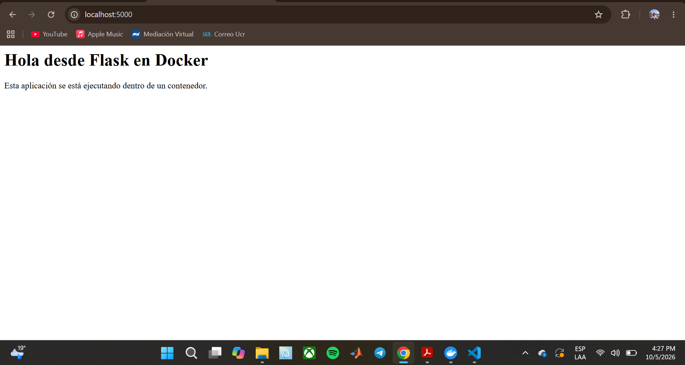

# Parte 6: Persistencia con volúmenes

## Objetivo

Comprender por qué los datos dentro de un contenedor pueden perderse y cómo los volúmenes permiten conservar información fuera del ciclo de vida del contenedor.

Por defecto, los datos que se crean dentro de un contenedor se pierden cuando este se elimina. Los volúmenes resuelven esto guardando los datos en un espacio administrado por Docker, separado de cualquier contenedor.

---

## Comando ejecutado: `docker volume create datos-lab`

```powershell
docker volume create datos-lab
```

### Explicación

Crea un volumen llamado `datos-lab`. Un volumen es un espacio de almacenamiento administrado por Docker que existe de forma independiente de los contenedores.

### Resultado obtenido

```text
datos-lab
```

---

## Comando ejecutado: `docker volume ls`

```powershell
docker volume ls
```

### Explicación

Lista los volúmenes que existen en Docker.

### Resultado obtenido

```text
DRIVER    VOLUME NAME
local     datos-lab
```

### Qué observé

Aparece el volumen `datos-lab` con el driver `local`, es decir, almacenado en la misma máquina donde corre Docker.

---

## Comando ejecutado: `docker run -it --name contenedor-volumen -v datos-lab:/datos ubuntu bash`

```powershell
docker run -it --name contenedor-volumen -v datos-lab:/datos ubuntu bash
```

### Explicación

Crea un contenedor interactivo llamado `contenedor-volumen` a partir de la imagen `ubuntu` y **monta el volumen** `datos-lab` dentro del contenedor, en la ruta `/datos`. La opción `-v` tiene el formato `-v NOMBRE_DEL_VOLUMEN:RUTA_EN_EL_CONTENEDOR`. Todo lo que se escriba en `/datos` dentro del contenedor se guarda realmente en el volumen.

### Problema que tuve

En el primer intento, el comando se partió en dos líneas al pegarlo en la terminal. La primera línea (`docker run -it --name contenedor-volumen -v datos-lab:/datos`) quedó sin la imagen, y Docker respondió:

```text
docker: 'docker run' requires at least 1 argument
```

Además, PowerShell intentó ejecutar la segunda línea (`ubuntu bash`) como si fuera un comando propio, y mostró que no lo reconocía. Como el primer `docker run` falló, no se creó ningún contenedor. Al volver a escribirlo en una sola línea funcionó. Esto me mostró que `docker run` necesita al menos la imagen como argumento.

### Resultado obtenido

Dentro del contenedor creé un archivo en la carpeta del volumen:

```text
root@11e11201c047:/# echo "Este archivo está en un volumen" > /datos/archivo.txt
root@11e11201c047:/# cat /datos/archivo.txt
Este archivo está en un volumen
root@11e11201c047:/# exit
exit
```

### Qué observé

El archivo `archivo.txt` se creó dentro de `/datos`, que es la carpeta donde está montado el volumen, y `cat` confirmó su contenido. (En la línea del `echo`, la terminal mostró la tilde de "está" como un código, pero el `cat` posterior muestra el texto correcto.)

---

## Comando ejecutado: `docker rm contenedor-volumen`

```powershell
docker rm contenedor-volumen
```

### Explicación

Elimina el primer contenedor. Con esto se pierde todo lo que estaba guardado en el sistema de archivos propio del contenedor, pero **no** el volumen, porque el volumen es independiente.

### Resultado obtenido

```text
contenedor-volumen
```

---

## Comando ejecutado: `docker run -it --name contenedor-volumen-2 -v datos-lab:/datos ubuntu bash`

```powershell
docker run -it --name contenedor-volumen-2 -v datos-lab:/datos ubuntu bash
```

### Explicación

Crea un contenedor completamente nuevo (`contenedor-volumen-2`) y le monta el **mismo** volumen `datos-lab` en `/datos`.

### Resultado obtenido

```text
root@128a4471aeb7:/# cat /datos/archivo.txt
Este archivo está en un volumen
root@128a4471aeb7:/# exit
exit
```

### Qué pasó con el archivo después de eliminar el primer contenedor

El archivo **siguió existiendo**. Aunque el primer contenedor se eliminó, el segundo contenedor (que tiene otro ID, `128a4471aeb7`, y es una instancia distinta) pudo leer `/datos/archivo.txt` con el mismo contenido. Esto demuestra que los datos se guardaron en el volumen y no dentro del contenedor.

Esto contrasta con la Parte 3, donde el archivo `mensaje.txt` se creó en el sistema de archivos del propio contenedor y desapareció junto con él al eliminarlo con `docker rm`.

---

## Comando ejecutado: `docker rm contenedor-volumen-2`

```powershell
docker rm contenedor-volumen-2
```

### Resultado obtenido

```text
contenedor-volumen-2
```

---

## Comando ejecutado: `docker volume inspect datos-lab`

```powershell
docker volume inspect datos-lab
```

### Explicación

Muestra, en formato JSON, la información detallada de un volumen: cuándo se creó, qué driver usa, dónde se almacena y qué nombre tiene.

### Resultado obtenido

```json
[
    {
        "CreatedAt": "2026-10-05T22:15:58Z",
        "Driver": "local",
        "Labels": null,
        "Mountpoint": "/var/lib/docker/volumes/datos-lab/_data",
        "Name": "datos-lab",
        "Options": null,
        "Scope": "local"
    }
]
```

### Qué observé

- `Name`: `datos-lab`, el nombre que le di al crearlo.
- `Driver` y `Scope`: `local`, porque se guarda en esta misma máquina.
- `CreatedAt`: fecha y hora de creación.
- `Mountpoint`: la ruta donde Docker guarda los datos del volumen. Esa ruta pertenece al sistema de archivos de Docker (en mi caso, dentro del entorno Linux que usa Docker Desktop), no a una carpeta normal de Windows.
- El volumen sigue existiendo aunque no haya ningún contenedor usándolo, porque ambos contenedores ya fueron eliminados.

---

## Resumen de lo aprendido

- **Qué es un volumen:** un espacio de almacenamiento administrado por Docker, independiente del ciclo de vida de los contenedores. Sirve para conservar datos aunque el contenedor se elimine.
- **Cómo se crea:** con `docker volume create NOMBRE`.
- **Cómo se monta en un contenedor:** con la opción `-v NOMBRE_DEL_VOLUMEN:RUTA_EN_EL_CONTENEDOR` al ejecutar `docker run`, por ejemplo `-v datos-lab:/datos`.
- **Qué pasó con el archivo después de eliminar el primer contenedor:** se conservó, y lo pude leer desde un contenedor nuevo que usó el mismo volumen.
- **Resultado de `docker volume inspect`:** muestra el nombre, el driver, el punto de montaje y la fecha de creación del volumen.

## Reflexión

Esta parte me permitió comprobar lo que antes solo había visto como idea: que un contenedor es desechable pero los datos pueden no serlo. Eliminé un contenedor completo y el archivo siguió ahí, listo para otro contenedor. También me di cuenta de que el volumen y el contenedor tienen vidas separadas: eliminar uno no elimina el otro.

---

## Preguntas de reflexión

**1. ¿Qué problema resuelven los volúmenes?**

Resuelven la pérdida de datos cuando un contenedor se elimina. Como los contenedores son desechables y lo que se guarda dentro de ellos desaparece con ellos, los volúmenes ofrecen un lugar donde guardar información que debe sobrevivir, como los datos de una base de datos o archivos que sube un usuario. También permiten que varios contenedores, uno tras otro, usen los mismos datos.

**2. ¿El volumen pertenece a un contenedor específico?**

No. Un volumen es un recurso independiente, con su propio nombre, que se crea por separado y luego se monta en uno o varios contenedores. Lo comprobé porque el volumen `datos-lab` lo usaron dos contenedores distintos, y seguía existiendo cuando ambos ya habían sido eliminados.

**3. ¿Qué diferencia hay entre eliminar un contenedor y eliminar un volumen?**

Eliminar un contenedor (`docker rm`) borra esa instancia y los datos que estaban en su propio sistema de archivos, pero no toca los volúmenes que tenía montados. Eliminar un volumen (`docker volume rm`) borra los datos almacenados en él de forma definitiva. Por eso hay que tener cuidado con el volumen: si contiene datos importantes, eliminarlo los pierde.

**4. ¿Para qué casos reales se usarían volúmenes?**

Para guardar los datos de una base de datos, archivos que suben los usuarios a una aplicación, logs que se quieren conservar o archivos de configuración que deben persistir. En general, para cualquier información que no se quiera perder cuando se actualiza o se reemplaza un contenedor.

---

## Bind mounts

### Objetivo

Comprender la diferencia entre un volumen administrado por Docker y montar una carpeta de mi computadora dentro de un contenedor (*bind mount*).

### Comando ejecutado

```powershell
docker run --name app-bind -p 5000:5000 -v ${PWD}:/app laboratorio-flask:1.0
```

### Explicación

Es la misma imagen `laboratorio-flask:1.0` de las partes anteriores, pero con la opción `-v ${PWD}:/app`. En PowerShell, `${PWD}` es la **carpeta donde estoy parado**, así que ese directorio de mi computadora se monta dentro del contenedor, en la ruta `/app`. Lo que el contenedor ve en `/app` ya no es la copia de los archivos que quedó guardada en la imagen, sino los archivos reales de mi carpeta.

### Problema que tuve

La primera vez ejecuté el comando desde la carpeta equivocada: estaba en `Laboratorio Contenedores` y no dentro de `App`. El contenedor terminó de inmediato y mostró este error:

```text
python: can't open file '/app/app.py': [Errno 2] No such file or directory
```

Con `docker ps -a` comprobé que el contenedor había terminado con error:

```text
CONTAINER ID   IMAGE                   COMMAND           CREATED              STATUS                          PORTS     NAMES
88ba0f40a422   laboratorio-flask:1.0   "python app.py"   About a minute ago   Exited (2) About a minute ago             app-bind-2
```

**Causa:** el bind mount **reemplaza** el contenido de `/app` dentro del contenedor por el contenido de la carpeta que monté. Como en `Laboratorio Contenedores` no está el archivo `app.py` (está dentro de `App`), Python no lo encontró y el contenedor se cerró con código `2`. Este error me mostró que, con un bind mount, lo que hay en la carpeta del host es lo que realmente usa el contenedor.

Para corregirlo eliminé el contenedor fallido (`docker rm app-bind-2`), entré a la carpeta de la aplicación y verifiqué que estuvieran los archivos:

```powershell
cd App
dir -Name
```

```text
app.py
Dockerfile
requirements.txt
```

### Primera ejecución 

Desde la carpeta `App`:

```powershell
docker run --name app-bind -p 5000:5000 -v ${PWD}:/app laboratorio-flask:1.0
```

```text
 * Serving Flask app 'app'
 * Debug mode: off
WARNING: This is a development server. Do not use it in a production deployment. Use a production WSGI server instead.
 * Running on all addresses (0.0.0.0)
 * Running on http://127.0.0.1:5000
 * Running on http://172.17.0.2:5000
Press CTRL+C to quit
172.17.0.1 - - [05/Oct/2026 22:27:09] "GET / HTTP/1.1" 200 -
```

Al abrir `http://localhost:5000` se veía la página con el texto original: "Esta aplicación se está ejecutando dentro de un contenedor."



### Modificación del código en mi computadora

Con el contenedor ya probado, modifiqué `app.py` **en mi computadora** (no dentro del contenedor ni en la imagen), cambiando el párrafo de la página principal:

```python
<p>Este texto lo cambié desde mi computadora.</p>
```

y guardé el archivo.

### Detener y eliminar el contenedor

```powershell
docker stop app-bind
docker rm app-bind
```

```text
app-bind
app-bind
```

### Segunda ejecución 

Volví a ejecutar el contenedor con el mismo comando, desde la carpeta `App`, **sin reconstruir la imagen** (no usé `docker build`):

```powershell
docker run --name app-bind -p 5000:5000 -v ${PWD}:/app laboratorio-flask:1.0
```

```text
 * Serving Flask app 'app'
 * Debug mode: off
WARNING: This is a development server. Do not use it in a production deployment. Use a production WSGI server instead.
 * Running on all addresses (0.0.0.0)
 * Running on http://127.0.0.1:5000
 * Running on http://172.17.0.2:5000
Press CTRL+C to quit
172.17.0.1 - - [05/Oct/2026 22:42:13] "GET / HTTP/1.1" 200 -
```

Al abrir `http://localhost:5000`, la página mostró el texto nuevo: "Este texto lo cambié desde mi computadora."


Al terminar detuve y eliminé el contenedor:

```powershell
docker stop app-bind
docker rm app-bind
```

### Qué ocurrió al modificar el código local

El cambio que hice en `app.py` en mi computadora apareció en la aplicación que corre dentro del contenedor, aunque la imagen `laboratorio-flask:1.0` seguía siendo la misma. Nunca ejecuté `docker build`. Esto pasó porque el contenedor no estaba usando la copia de `app.py` guardada en la imagen, sino directamente el archivo de mi carpeta, montado en `/app`.

Tuve que detener el contenedor y ejecutarlo de nuevo para ver el cambio, porque Flask se ejecuta con `Debug mode: off` y por eso no recarga el código automáticamente cuando el archivo cambia.

### Diferencia entre `datos-lab:/datos` y `${PWD}:/app`

| | `-v datos-lab:/datos` | `-v ${PWD}:/app` |
|---|---|---|
| Tipo | Volumen administrado por Docker | Bind mount (carpeta del host) |
| Origen | Un nombre (`datos-lab`) | Una ruta de mi computadora (la carpeta actual) |
| Dónde viven los datos | En un espacio que Docker administra (`/var/lib/docker/volumes/...`) | En una carpeta normal de mi computadora, que yo puedo abrir y editar |
| Se crea con | `docker volume create` | No hace falta crearlo; usa una carpeta que ya existe |
| Uso típico | Datos persistentes de una aplicación | Desarrollo: ver los cambios del código sin reconstruir la imagen |

### Por qué esto puede ser útil durante el desarrollo

Porque puedo editar el código con mi editor, como siempre, y el contenedor usa esos cambios de inmediato sin tener que reconstruir la imagen cada vez. Esto ahorra mucho tiempo al probar cambios, y la aplicación corre en el mismo entorno que tendría en producción.

### Reflexión

Esta parte me mostró dos cosas. Por un lado, que montar una carpeta es muy práctico para desarrollar. Por otro, que el bind mount puede ocultar o reemplazar lo que la imagen tenía en esa ruta, como me pasó cuando ejecuté el comando desde la carpeta equivocada. Antes de usarlo conviene verificar siempre en qué carpeta estoy parada.

### Preguntas de reflexión

**1. ¿Qué diferencia hay entre un volumen y un bind mount?**

Un volumen lo crea y administra Docker, y se identifica por un nombre; no depende de ninguna carpeta concreta de mi computadora. Un bind mount conecta directamente una carpeta que ya existe en mi computadora con una ruta dentro del contenedor, y los archivos que se ven son los mismos en ambos lados. Con el volumen `datos-lab` los datos quedaron en un espacio administrado por Docker; con el bind mount, la aplicación usó el `app.py` de mi carpeta.

**2. ¿Cuál parece más conveniente para desarrollo?**

El bind mount, porque puedo editar el código en mi computadora y el contenedor lo usa de inmediato, sin reconstruir la imagen. Lo comprobé al cambiar el texto de la página.

**3. ¿Cuál parece más conveniente para datos persistentes de una aplicación?**

El volumen, porque lo administra Docker, no depende de la estructura de carpetas de mi computadora, y es más fácil de mover y respaldar. Es lo recomendado para cosas como los datos de una base de datos.

**4. ¿Qué riesgos podría tener montar carpetas del host dentro del contenedor?**

El contenedor puede leer y modificar los archivos reales de mi computadora que estén en esa carpeta, así que un error o un programa malicioso dentro del contenedor podría afectar mis archivos. Además, el montaje reemplaza el contenido original de la ruta dentro del contenedor, como me pasó con el error de `app.py`, y depende de la ruta y los permisos de cada sistema operativo, lo que dificulta que funcione igual en otra máquina. Por eso conviene montar solo las carpetas necesarias.
